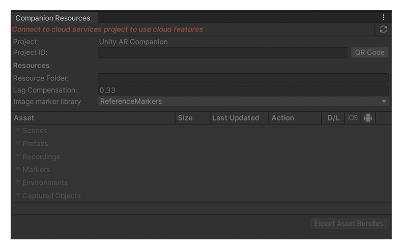

# Unity AR Companion Core

The Unity AR Companion Core package is used to sync resources for the Unity AR companion apps. This documentation gives a brief overview on how to use the package, and covers its technical requirements and known limitations.

## Preview package

This package is available as a preview, so it is not ready for production use. The features and documentation in this package might change before it is verified for release.

## Install Unity AR Companion Core

The Unity AR Companion Core package will be installed along with new Unity MARS installations. To manually install the Unity AR Companion Core package
- Open the Package Manager Window.
- Click the **+** drop-down.
- Choose **Add package from git URL...**
- Type `com.unity.ar-companion-core` and press Enter.

To learn more about packages, go to the [Package Manager documentation](https://docs.unity3d.com/Packages/com.unity.package-manager-ui@latest/index.html).

## Create a Project ID

AR Companion Core uses a Project's cloud Gaming Services ID to connect a Project in the Editor to one in the AR Companion Mobile app. To create a new services Project ID, or link to an existing Unity Gaming Services Project ID, see [Setting up your project for Unity services](xref:SettingUpProjectServices).

If your project is not linked to Unity's Cloud Services, you will see the following:

 *The AR Companion Resources window (unlinked)*

Once you have created or assigned a services Project ID, you can use it to connect the current Unity Project to a project in the AR Companion Mobile app. See [Link your project to the Companion App](AR-companion-mobile.md#link-project) for instructions.

# Synchronize data

Use the [Companion Resources window](companion-resource-manager.md) to download the AR data you capture or create in the AR Companion Mobile app. 

1. Open the **Companion Resources** window (menu: **Window > AR Companion > Resource Manager**).
2. Link the AR Companion Mobile app project to your Unity project, if you have not already done so.
3. Click the update button in the top-right corner of the **Companion Resources** window to refresh the data shown.
4. Click the [Action](companion-resource-manager.md#actions) button next to specific resources to download them to the local Unity Project.

See [Publishing Scenes and Prefabs](publish-scenes-prefabs.md) for information about transferring Scenes and Prefabs to the AR Companion Mobile app.

# Viewing data recordings (MARS-only)
To view data recordings which have been imported, follow these steps:

1. Change the Unity MARS Simulation View **mode** to Recordings.
2. Use the **source** drop-down to find your recording under the **Data** section.

The **Device View** will have its scene camera follow the recorded camera path, and the recording data providers will simulate AR data for planes and point cloud, if provided. To learn more about Unity MARS session recordings, see [Session Recordings](https://docs.unity3d.com/Packages/com.unity.mars@latest/index.html?subfolder=/manual/SessionRecordings) in the Unity MARS documentation.

# Technical details
## Requirements

This version of Unity AR Companion Core is compatible with the following versions of the Unity Editor:

* [2019.4.15f1](https://unity3d.com/unity/whats-new/2019.4.15) or later

## Known limitations

Unity AR Companion Core version 1.0 includes the following known limitations:

* When linking a mobile project to a Cloud project, the Cloud project name will take precedence.
* AssetBundles for scenes and prefabs built with Unity versions newer than 2019.4.30f1 cannot be used in the current version of the app. See [AssetBundle compatibility](publish-scenes-prefabs.md#assetbundle-compatibility) for more information.
* Video files captured on Android devices will print warnings to the console when they are imported by the Editor on Windows. In 2019.4 these warnings are followed by many more warnings and errors related to `TLS Allocator`. These warnings and errors can be safely ignored, and only happen when the importer runs. You can work around this issue by running the `.mp4` file through a video encoder like Adobe Media Encoder or Handbrake. Required settings will vary depending on the program used, but make sure to use a constant frame rate and disable the audio stream when you do this or you may introduce more issues.

