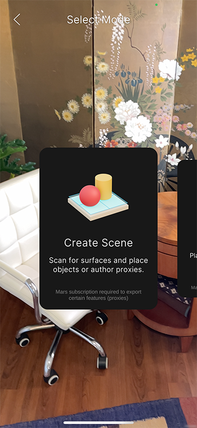

# Home view

Tap the **AR Capture Mode** button at the bottom of a Project's **Resource List** view to enter the **Home** view, where you can switch between the app's five main modes:

- [Create Scene](scene-creation-workflow.md)
- [Environment](environment-capture-workflow.md)
- [Marker Creation](marker-capture-workflow.md)
- [Record Data](record-data-workflow.md)
- [Capture Object](object-capture-workflow.md)

Swipe left or right on the cards to select the mode you want to use, then tap the **Start** button. To return to the **Resource List** view, tap the **&lt;** button.