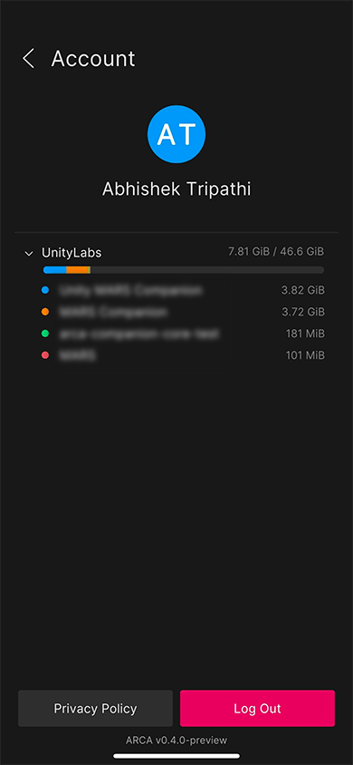

# Profile view

From the **Project** view, tap the circular blue button with your initials on it to go to the **Profile** view. If you skipped login, this circle displays the letter **U** instead.

The Profile view displays information about the user who is currently logged in to the app, as well as the total data usage across all of their Unity AR Companion projects. To log out and go back to the **Sign In** view, tap **Log Out**. If you skipped login, the button will read **Log In**. Tap the **Privacy Policy** button to view the Unity AR Companion app privacy policy in your device's browser. The version number of the app is displayed at the very bottom of the screen. Tap back to return to the **Project** view.

## Data usage

Each Unity account associated with a project can use 1GiB of free storage. In addition to free storage, each Unity MARS subscription contributes an additional 9GiB of Unity AR Companion cloud storage to the Unity Cloud organization it is associated with. This storage cap does not apply to any other Unity services. Projects associated to a given organization share storage, and thus as more and more files are stored, the total free storage available to each individual project decreases.

To see the data usage for individual projects, tap the **Expand Icon** next to an organization's name. 