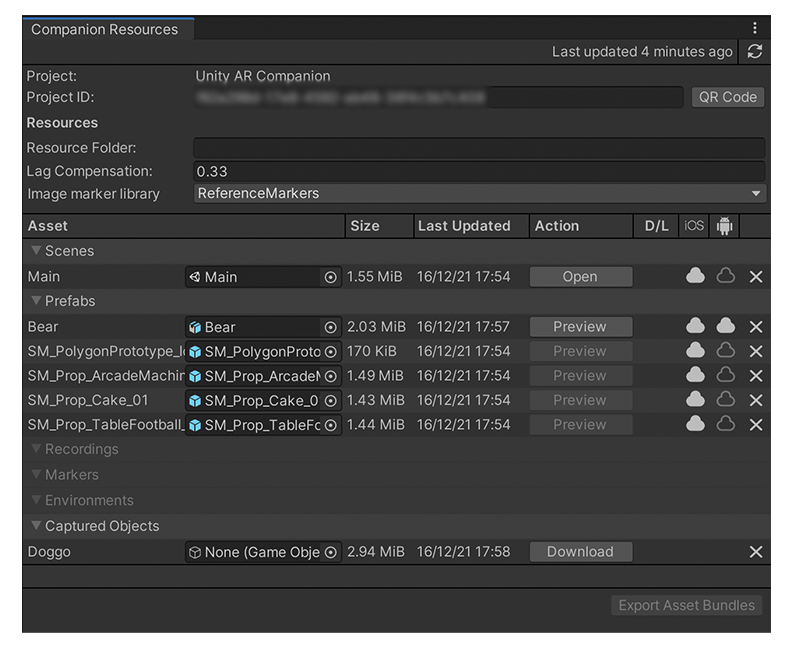
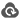

# Companion Resources window 

The **Companion Resources** window displays the resources stored in the Unity Gaming Services cloud for the linked services Project. To open this window, from Unity's main menu, go to **Window &gt; AR Companion &gt; Resource Manager**. Use the window to download assets to the local project, to build and upload AssetBundles for Scenes and Prefabs you have published, and to delete resources from the cloud.

In order to sync resources to and from the AR Companion Mobile app, you must link your Project using a [Unity Gaming Services Project ID](https://docs.unity3d.com/Manual/SettingUpProjectServices.html). To link your project, create a new Project ID from the services window (menu: **Window &gt; General &gt; Services**) or link to an existing project. You can then link the local Project to a project in the AR Companion Mobile app using the same Services Project ID. See [Linking your Project](AR-companion-mobile.md#link-project).

Once your project is linked, and you have published some resources, you will see the following:

 *The Companion Resources window displaying some published resources.* 

The **Companion Resources** window contains the following elements:

| **Window element** | **Purpose** |
|:---|:---| 
| **Last updated**| How long it has been since you refreshed the window. Note that the window does not refresh automatically.|
| **Update button**| Refreshes the information in the window to reflect any changes in the assets stored in the cloud. Changes can be from the AR Companion Mobile app or from other people working on the Project in the Editor. |
| **Project**| The project name. |
| **Project ID**| The Unity Gaming Services Project ID. |
| **QR Code** button| Opens a window showing the QR code to scan to connect this Project to one in the AR Companion Mobile app. The QR code contains the Project ID. |
| **Resources Folder**| The subfolder in which resources are saved in the cloud. Use the same Resource Folder name here as you use in the AR Companion Mobile app. |
| **Lag Compensation**| The number of seconds to delay camera poses to compensate for video lag. |
| **Image marker library** | Any Markers you capture with the AR Companion Mobile app are added to this image marker asset.  |
| **Asset**| The Asset column contains an object field to indicate which Unity project asset is associated with the cloud resource. This displays **None** for resources which have not been imported into the project or did not originate in this project. The `Assets/AR/Settings/CompanionResourceSync` asset keeps track of which cloud resource is associated with which Unity project asset, and this asset should be tracked in version control so that all users of the project have the same asset files associated with their corresponding cloud resources. |
| **Size**| The asset memory size. |
| **Last Updated**| The last time an asset was updated in the cloud. |
| **Action**| Contains buttons for performing an action for an individual asset. The available buttons depend on the type and status of the asset. See [Actions](#actions).|
| **D/L**| Displays a progress indicator while a download operation is in progress. |
| **iOS** and **Android** | The cloud icons in the iOS and Android columns indicate the state of the AssetBundle for that platform:  `Not Uploaded`: The resource will not have an AssetBundle after it is synced. Either it never had one, or you selected this state to indicate that it should be deleted.  `Uploaded`: The resource will have an AssetBundle after it is synced. Either it already has one, or you selected this state to indicate that it should be published.  `Update`: The resource has changed since this platform bundle was originally published, and this bundle will be uploaded as part of the sync. If the resource is in this state you can click the **cloud button** once to switch to the `Uploaded` state, which will keep the old version. Clicking the **cloud button** a second time will switch to the `Not Uploaded` state, which will indicate that it should be deleted. Clicking the **cloud button** a third time will return it to the `Update` state.  `Warn`: The resource has changed since this platform's bundle was originally published, but the platform required to publish it is not installed. If the resource is in this state you can click the **cloud button** to indicate that it should be deleted, or click it again to cycle back to the `Warn` state and keep the old version.   When you click the **Update** button to refresh the **Companion Resource** window, the process sets the cloud icons to reflect the remote state of each resource. You can click the cloud icons to specify a different state, which enables the **Export Asset Bundles** button. Use the **Export Asset Bundles** button to synchronize the remote state of the resource to match the desired state. For example, if you change the state of a resource from `Not Uploaded` to `Uploaded`, then the Editor builds the AssetBundle for that platform and uploads it to the Project's cloud resources folder when you click **Export Asset Bundles**.|
| **Delete button (X)**| Removes the resource from the Asset list and from remote storage. If a local version of the asset exists it is not deleted, but it is no longer associated with a Companion resource. |
| **Unique ID** | Hover the mouse cursor over a resource's metadata in the **Asset**, **Size**, or **Last Updated** column to see a tooltip with its unique identifier. |
| **Export Asset Bundles button**| Synchronizes the remote state of resource AssetBundles to match the current settings of the cloud icons in the **iOS** and **Android** columns. For example, if you change the icon of a Prefab to  `Not Uploaded`, then **Export Asset Bundles** removes the AssetBundle for that Prefab from the cloud.  Rebuilds any AssetBundles in the  `Update` state and, if necessary, those in the  `Uploaded` state. Rebuilding AssetBundles can require the process to change the current Project build target.  Only enabled when you have made changes that require synchronization. |

> [!TIP]
> To update Scene and Prefab resources that you have modified in the Editor, you must first [Publish](publish-scenes-prefabs.md) the changes to the assets. Publishing the asset changes the resources cloud statues icon to  and enables the **Export Asset Bundles** button.

## Actions

The **Action** button available for a resource depends on the type and state of a resource.

### Create

Downloads the images taken for a Captured Object resource and, if the Object Capture package is installed, generates the 3D model.

### Download

Downloads the resource to the Project Asset folder (except for Captured Objects). (Press **Cancel** to abort the download operation before it finishes.)

The resources for Captured Objects are downloaded to the Project's Temp folder. 

> [!NOTE]
> Unity deletes the Temp folder when you close a Unity project. To avoid downloading the Object Capture files again, you must copy them to a location outside the Temp directory.

### Open 

Downloads and opens the Scene in the Editor (closing the current Scene).

### Preview 

Downloads and adds the Prefab to the current Scene.

To preview a Prefab, an AssetBundle containing the Prefab must be available for the current Platform build target. In other words, to preview Prefabs when you have set the build target to Android, you must have published an Android AssetBundle. (See [Publish Scenes and Prefabs](publish-scenes-prefabs.md) for more information.)

Note that the objects in a Scene created by this action are not be linked to the Prefab in the Project, and may not match what is in the Prefab in the Project, because the current version may have been modified since it was last published.

