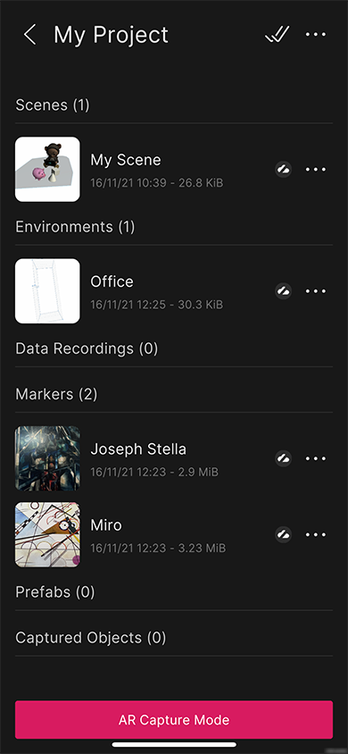

# Resource list view

The **Resource List** view shows a list of all resources in a given **Resource Folder** for the project which was selected in the **Project List** view. You can expand or collapse the groups or resources by tapping the header.

## Opening scenes

Tapping on a scene resource opens the **Scene Creation** flow with that scene loaded. If the scene was published from the Editor and requires an AssetBundle, the app displays an on-screen message indicating that the bundle is being downloaded. When the download finishes, the app proceeds to the **Scene Creation** flow. If the AssetBundle has not been published for the current platform or failed to download, you will see a message appear briefly in the **Scene Creation** flow that says `Scene AssetBundle is missing for this platform`.

If a scene has been modified in the cloud since the last time you saved or opened it on your device, the scene will be in the `Conflicted` state. When you try to open it, a context menu displays. You can either choose to download the cloud version or upload your local version to the cloud to resolve the conflict. After the conflict is resolved, tap the scene to open it.

If you wish to edit a conflicted scene offline, you must unlink the project. You can re-link the project at any time.

## Resource status icons

Some resources have an icon to display their synchronization status. A Unity AR Companion resource can be in one of the following states:
-  `Local Only`: The resource only exists locally on the device and can be uploaded to the cloud.
-  `Synced`: The resource exists in the cloud and on the device, and both versions have the same timestamp.
-  `Cloud Only`: The resource only exists on the cloud and can be downloaded to the device.
-  `Conflicted`: The resource exists in the cloud and on the device, but each version has a different timestamp.

Resources can also appear grayed out and with no status icon. Because these resources exist in the cloud but cannot be downloaded to the device, they are not considered `Cloud Only`. The only action you can take on these resources is to delete them from their context menu.

Because you can only download and edit `Scene` resources after they are uploaded, these are the only resources that can show the `Cloud Only` or `Conflicted` status.

## Resource list multi-select

Tap the **Multi-Select Icon** in the **Resource List** view to enter multi-select mode. Toggle the selection state on resources in the resource list and tap **Delete** to delete multiple resources. Tap **Done** to exit multi-select mode.

## Resource list context menu

You can bring up a context menu for an individual resource by tapping the **More** icon (&#8226;&#8226;&#8226;) next to it.

Depending on the type of resource, and whether or not it can be uploaded or downloaded, you might see one or more of the following options:

- **Rename** opens the system keyboard and allows you to rename a scene.
- **Duplicate** duplicates a scene.
- **Delete** deletes the resource.
- **Upload** uploads a resource which only exists locally or is in conflict.
- **Download** downloads a resource which only exists on the cloud or is in conflict.

Tap anywhere in the shaded area above the context menu to dismiss it.

## Resource list view settings

Tap the **More** icon (&#8226;&#8226;&#8226;) next to the project title to open the **Project Settings** menu.

Enter a resource folder into the text field to open the resource list for that folder. The list updates automatically when you dismiss the keyboard. Resource folder names are case sensitive and include whitespace, so be careful not to leave an extra space at the end if the system keyboard added it for you.

If the project is not linked to a Unity Cloud Services project, this menu contains a text field that allows you to rename the project.