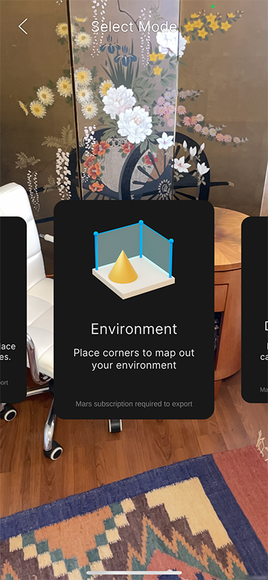
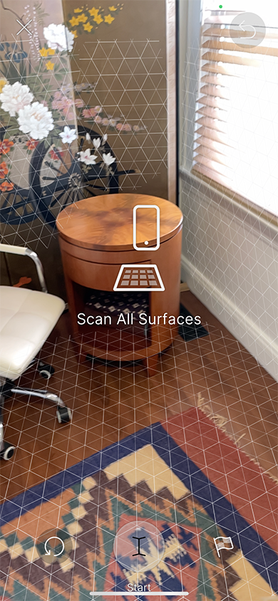
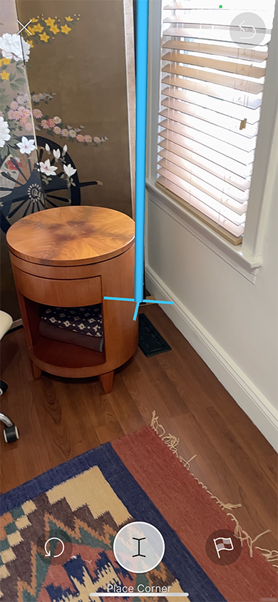
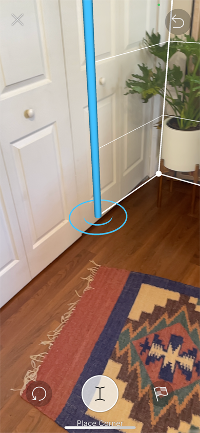
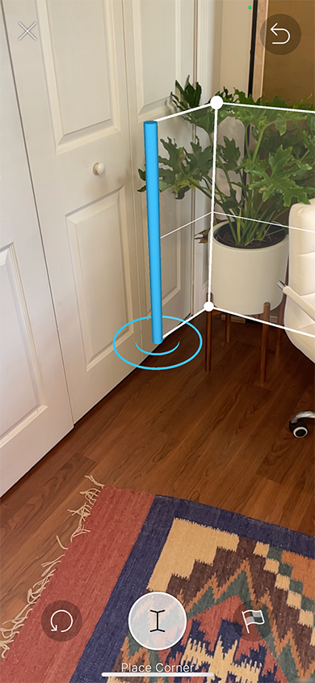
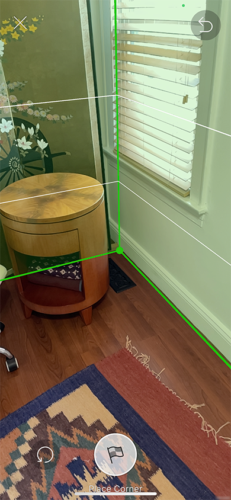

## Environment Capture workflow

Enter the **Environment Capture** workflow from the [Home view](companion-home-view.md).

The purpose of this flow is to capture the room as a synthetic environment for use in the Editor. Start by scanning all of the surfaces you wish to capture, including the floor. At any time during the flow, you can press the **Restart** button on the left to remove all surfaces, clear the floor plan, and restart scanning.

When you are done scanning all surfaces you wish to capture, press **Start**. This button becomes active as soon as the floor is detected.

When you press **Start**, the surface visuals disappear and a **Cursor Post** appears. The **Cursor Post** is anchored to the floor so that the bottom of the post lines up with the center of the screen. Tapping **Place Corner** starts a **Floor Plan**, which allows you to capture the walls of the room if you weren't able to scan them as surfaces. It is highly recommended that you scan thoroughly and include a floor plan to help you recognize the environment in the Editor.

To complete the flow and save the environment, with or without a floor plan, tap the **Finish** button on the right at any time.

After placing the first corner, you will see a wall outline between the first corner and the cursor. Keep tapping **Place Corner** to add more walls. The **Place Corner** button is disabled if the cursor is too close to an existing corner.

While you are placing corners, you can swipe up and down anywhere on the screen to adjust the height of the walls. It is often easiest to adjust wall height after you have placed a few corners.

If you have at least two walls and line up the cursor with the first corner, the walls will turn green and the **Place Corner** button will be replaced by the **Finish** button.

When you tap **Finish**, the app prompts you to save the environment.

Tap **Discard** to discard the environment scan. The app asks you to confirm the action. Tap **Discard** to confirm and discard the current environment scan, which returns you to the **Home View**. Tap **Cancel** to dismiss the confirmation prompt.

Tap **Save** to save the environment. This saves the environment to the cloud, adds it to the resource list, and caches a local version to the device's local storage. You can rename the environment using the text field above the two buttons.
