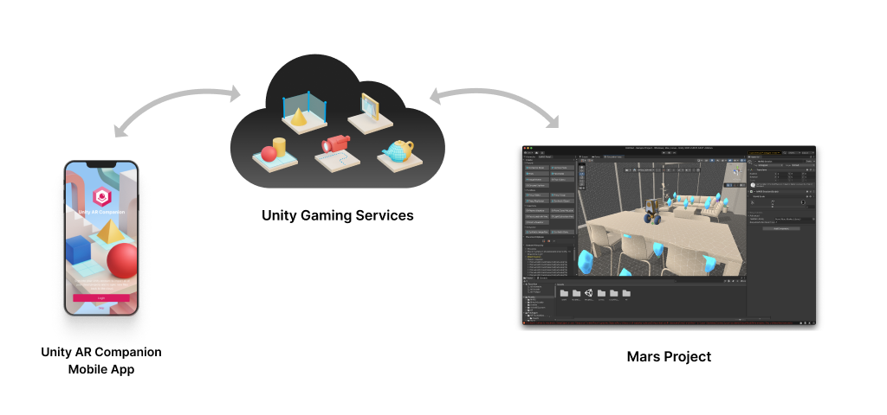

# Unity AR Companion

The Unity AR Companion allows you to use real-world data to help build and test AR applications with Unity.

The Unity AR Companion has two main parts:

* the AR Companion mobile app that you install on your device from the iOS App Store or the Google Play Store
* the AR Companion Core package that you install in a Project in the Unity Editor

The Companion mobile app captures AR data and transfers it to the linked Unity project via the Unity Gaming Services cloud infrastructure. Create a Unity cloud [Project ID](xref:SettingUpProjectServices) to connect a project in the mobile app to a project in the Unity Editor. 

> [!NOTE]
> Users without a Unity MARS subscription can use the **Object Capture** feature and limited functionality within the **Create Scene** workflow.

## Install Unity AR Companion Core

The Unity AR Companion Core package will be installed along with new Unity MARS installations. To manually install the Unity AR Companion Core package
- Open the Package Manager Window.
- Click the **+** drop-down.
- Choose **Add package from git URL...**
- Type `com.unity.ar-companion-core` and press Enter.

To learn more about packages, go to the [Package Manager documentation](https://docs.unity3d.com/Packages/com.unity.package-manager-ui@latest/index.html).

## Overview

You can use the AR Companion mobile app to record AR data to help build an AR app in Unity. You can upload the captured data to the Unity Editor and use it to design and test your AR application.

The types of data you can capture include:

* **Scenes:** you can create or modify a Unity Scene that contains the surfaces and point clouds detected with your mobile device. You can also place Prefabs in the Scene and create proxy objects. 
* **Environments:** you can capture surfaces and room floor plans to use as synthetic environments in the Unity MARS Simulation view.
* **AR data:** you can record an AR session that includes video, the path of the camera, and any detected surfaces. You can replay the recorded data inside the Unity MARS Simulation view.
* **Markers:** you can take photos to create image markers and identify the image hotspots.
* **3D Objects:** you can take pictures of real objects to create 3D models of them. (Generating 3D models has [additional hardware and software requirements](#3d-object-capture-requirements)).

You can modify a Scene you have created in the AR Companion app and transfer it back and forth between the app and the linked Unity Project as you test and modify it. You can also transfer custom Prefabs from your project to the Companion app so that you can place them in the Scenes in the app. 

> [!IMPORTANT] 
> To view custom assets and Prefabs in the AR Companion Mobile app, you must export them with Unity [2020.3.29f1]((https://unity3d.com/unity/whats-new/2020.3.29)). See [AssetBundle compatibility](publish-scenes-prefabs.md#assetbundle-compatibility) for more information.

## Requirements

### Unity Editor requirements

The current version of Unity AR Companion Core is compatible with the following versions of the Unity Editor:

* [2020.3.17f1](https://unity3d.com/unity/whats-new/2020.3.17) or newer

To export Scenes and Prefabs from the Editor to the AR Companion Mobile app, Unity recommends version [2020.3.29f1](https://unity3d.com/unity/whats-new/2020.3.29) for best compatibility. See [AssetBundle compatibility](publish-scenes-prefabs.md#assetbundle-compatibility) for more information.

### AR Companion Mobile requirements

* The Unity AR Companion app for iOS requires Apple ARKit and iOS 11.0 or later.
* The Unity AR Companion app for Android requires [Google ARCore 1.22](https://developers.google.com/ar/devices) or higher.
 
### 3D Object Capture requirements

* Unity 2020.3 or newer
* macOS Monterey
* A GPU that supports ray tracing and has at least 4 GB of video RAM
* 16+ GB system RAM

Object Capture depends on Apple's RealityKit. See [Creating 3D Objects from Photographs](https://developer.apple.com/documentation/realitykit/creating_3d_objects_from_photographs) in Apple's RealityKit documentation for more information. 

> [!TIP]
> You can capture images using either the Android or the iOS version of the AR Companion Mobile app. Only the computer running the Unity project that you are using to generate the 3D reconstructions must meet these requirements.

\* *Apple and ARKit are trademarks of Apple Inc., registered in the U.S. and other countries and regions.*
