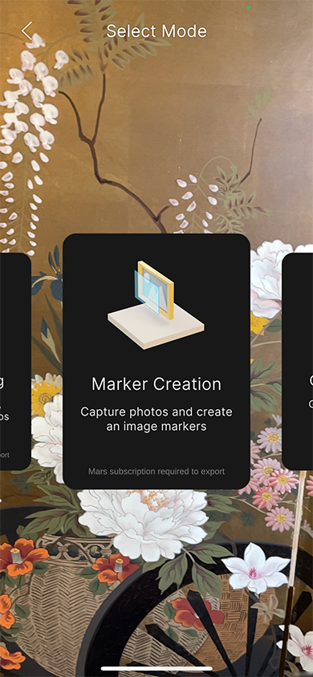
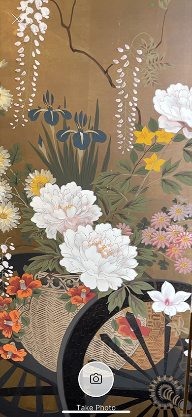
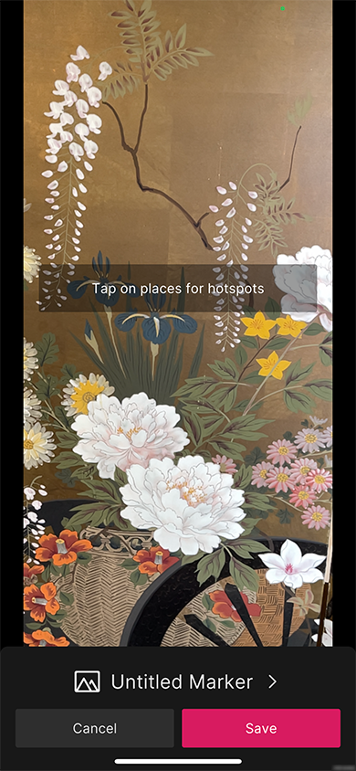
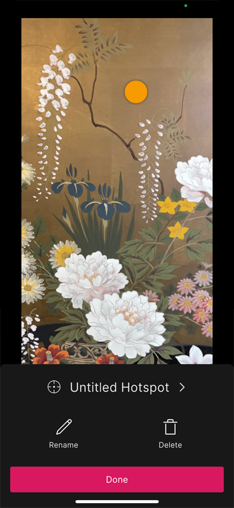
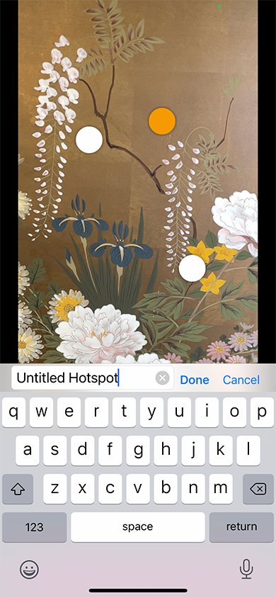
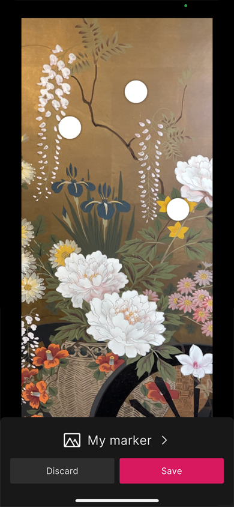

## Marker Capture workflow

Enter the **Marker Capture** workflow from the [Home view](companion-home-view.md).

The purpose of this flow is to capture an image for use as an **Image Tracking Marker** and identify **Hotspots** on the image.

Tap **Take Photo** to capture the current camera image.

Tap anywhere on the image to add a **Hotspot**.

Tap **Done** to return to the previous menu, or **Delete** to delete the hotspot.

Tap **Rename** to rename the hotspot.

In the previous view, you can tap the name of the maker to rename it.

Tap **Discard** to discard the marker and hotspots. The app asks you to confirm the action. Tap **Discard** to confirm, which discards the current marker and hotspots and returns you to the **Capture View**. Tap **Cancel** to dismiss the confirmation prompt.

Tap **Save** to save the marker to the cloud, add it to the resource list, and save a local copy. This also brings you back to the **Capture View** so you can capture another image.
