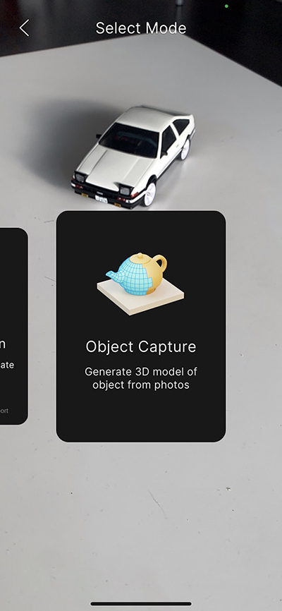
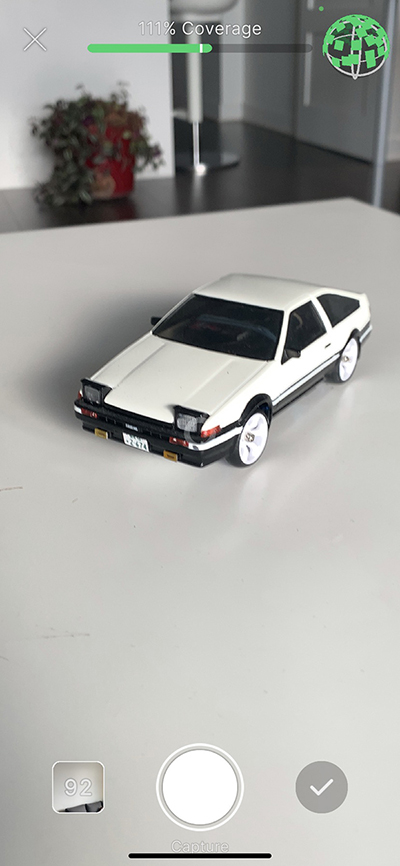
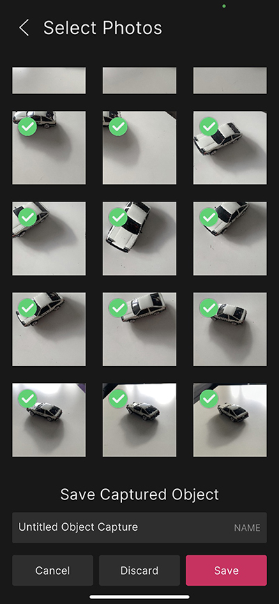

# Object Capture

Use Object Capture mode to create a 3D asset for your project from any real world object. To capture an object, take overlapping pictures of it from multiple viewpoints.

Object Capture mode relies on Apple's [Object Capture](https://developer.apple.com/augmented-reality/object-capture/) technology. To generate the captured 3D model in the Unity Editor after scanning an object, you must use a Mac computer with macOS Monterey and a "high-power" GPU. However, you can scan the objects used to create a 3D model with either an iOS or an Android device.

See [3D Object Capture requirements](index.md#3d-object-capture-requirements) for more information about the hardware and software requirements.

## Object Capture Workflow

To scan an object, use the Object Capture mode in the AR Companion App.

 *Object Capture mode*

> [!NOTE]
> * In order to upload your Object capture, you should log in and a use a project that has been linked.
> * The Object capture view may take a few seconds to load. This is expected behavior.

When the Object Capture view opens, you can take pictures of your object. The following picture shows a toy car in the process of being scanned:

 *Object Capture coverage*

As you scan an object, the capture view displays the following information:

* **Coverage percentage**: estimates how much of the object has been scanned 
* **Visual coverage globe**: shows the different vantage points from which you have taken a picture
* **Preview images button**: shows the number of pictures you have captured

A typical scan can require between 100-200 pictures. Always take overlapping pictures of the object to achieve full coverage.

To finish the scan, you can either tap the preview images button (at the bottom left) or the check mark (bottom right).  Finishing a scan takes you to the gallery view.

 *Gallery view*

In the gallery view, you can deselect images that you do not want to use by tapping them. When you are satisfied with the set of images, you can assign a name and tap the **Save** button. 

Tap **Cancel** or **<** to go back to the Object Capture view where you can take additional pictures.

Tap **Discard** to discard all pictures and return to to the AR Capture Mode selection view.

When you choose **Save**, the companion app compresses your images and uploads them to the cloud. 

You can view the captured object asset in your linked Unity Project on the [Companion Resources window](companion-resource-manager.md) once uploaded.

To complete the object capture and generate a 3D object, click the [Create](companion-resource-manager.md#create) button next to the asset in the **Companion Resources** window. 

> [!WARNING]
> If you tap the **X** button at the top of the Object Capture view, any pictures you have taken for the current scan are discarded.

## Adding the Object Capture package in Unity
Since the Object Capture package is a preview package, it will not show up directly in the package manager.

To install the Object Capture package
- Open the Package Manager Window.
- Click the **+** drop-down.
- Choose **Add package from git URL...**
- Type `com.unity.xr.object-capture` and press Enter.

## Tips for better object captures

* The more pictures the better.
* Take overlapping pictures.
* Scan in a well-lit environment.
* Use a background with good contrast to the scanned object.
* You can position your object on it's side to take pictures of the bottom, if desired. 

See Apple's [Capturing Photographs for RealityKit Object Capture](https://developer.apple.com/documentation/realitykit/capturing_photographs_for_realitykit_object_capture) article for more tips.
