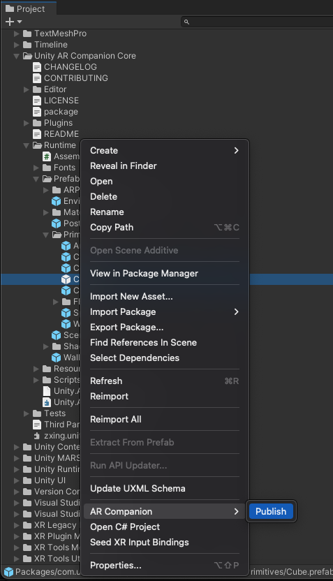

# Publish Scenes and Prefabs

You can publish the following asset types in order to use them in the AR Companion Mobile app:
- Scenes
- Prefabs

To publish, use the context (right-click) menu for assets. Right-click the Scene or Prefab in the **Project** view, then select **AR Companion &gt; Publish** from the context menu.

 *The Publish context menu*

The first time you publish a scene containing asset references, Unity displays a dialog to save an additional ScriptableObject called an `AssetPack` which contains the references to these assets and their GUIDs. (When this file already exists, Unity updates the existing ScriptableObject.) Unity also logs instructions to the console to remind you to publish an AssetBundle for these assets. To finish publishing the AssetBundle, use the **cloud buttons** and **Export Asset Bundles** button in the **Companion Resource Manager** window.

The Unity AR Companion app supports publishing to iOS and Android. If you see any cloud icons in the `Update` or `Warn` state, you might encounter issues when trying to use those Scenes or Prefabs in the AR Companion Mobile app.

To publish and export AssetBundles:

1. If you are changing already uploaded Scenes or Prefabs, make sure you have the latest version. (The cloud icon for each platform should be in the  `Uploaded` state on the **Companion Resources** window.)
2. In the Unity Project panel, right-click the Scene or Prefab, then select **AR Companion &gt; Publish** from the context menu.
3. If necessary, select a location to save the `AssetPack` file (for newly published Scenes only).
4. Open the **Companion Resources** window (menu:**Window > AR Companion > Resource Manager**)
5. Under **Assets**, the Scenes and Prefabs you have published are listed with cloud icons in the **iOS** and **Android** columns:
   * Assets you are publishing for the first time have a  `Not Uploaded` icon.
   * Assets you have previously published and uploaded have an  `Update` icon
6. For new assets, click the cloud icons to put them in the  `Uploaded` state.
7. Click the **Export Asset Bundles** button to start the build and update process. 

> [!NOTE]
>* The **AR Companion &gt; Publish** context menu option only prepares the JSON content of a Scene, or the metadata for a Prefab. When publishing an asset for the first time, you must also export the AssetBundles for the platforms you wish to use it on from the [Companion Resources](companion-resource-manager.md) window.
>
> * Currently, Unity does **not** check if a resource has changed since the last time you published it. Regardless of whether or not it is strictly necessary, Unity always suggests that you publish an AssetBundle whenever the AssetBundle timestamp is earlier than the resource's upload timestamp.
>
> * The AR Companion cannot build AssetBundles for an AssetPack or Prefab that you have manually assigned to a non-AR Companion AssetBundle. If you set the `AssetBundle` drop-down at the bottom of the Inspector for an asset to anything other than `None`, you will see an error when you try to publish AssetBundles in the AR Companion. To publish Prefabs or AssetPacks that are currently part of a non-AR Companion AssetBundle, you must first set its `AssetBundle` property to `None`, then click **Export Asset Bundles** in the Companion Resource Manager. Once the AR Companion publish process is complete, you can switch the `AssetBundle` property back to its original value.
>
> * AssetBundles are not forwards-compatible. The current version of the Unity AR Companion App available on App Stores was built with Unity 2020.3.29f1. AssetBundles built with newer versions of Unity might not load correctly. See [AssetBundle compatibility](#assetbundle-compatibility) for more information.

# AssetBundle compatibility
AssetBundles allow Unity Player builds to import assets that were not included in the initial build. The most common use case is a mobile app which downloads extra content from the internet after it is installed, in order to minimize the initial download size or provide extra content that is unlocked through game play. In this scenario, developers have full control over the process of creating the Player build and AssetBundles, and ensure they are both built with the same version of Unity.

Because the AR Companion App is distributed through App Stores, there is only one supported release stream for AssetBundles. The app is currently built using [Unity 2020.3.29f1](https://unity3d.com/unity/whats-new/2020.3.29), which means that this is the only Editor version for which AssetBundles are guaranteed to work. Bundles exported out of other 2019.4 patch versions, for example 2019.4.29f1 may still work, but it will depend on what kind of components and assets are referenced by the prefab.

If you are developing a project in a different version of Unity, you can use the following workarounds to export Scenes and Prefabs for use in the AR Companion Mobile app:

* Use another Project, or a copy of your Project, that is opened in 2020.3.29f1 to export the AssetBundles for the Scenes and Prefabs. 
* If there are issues preventing your main Project from working in this version of Unity, you can export a Unity Package (`.assetpackage`) containing the Assets you wish to publish, and import them into a fresh Project made with 2020.3.29f1. 
* If this option is unsuitable, Unity recommends that you use the built-in Prefabs to mock up your content in AR, and then replace them in the Editor by deleting the Prefab instances in the imported Scene and replacing them with the Prefabs of your choice. If you save this Scene and bring it back into the AR Companion Mobile app, these custom Prefabs will not be visible, but their guid and overrides are preserved in the Scene file when it is modified and saved.
