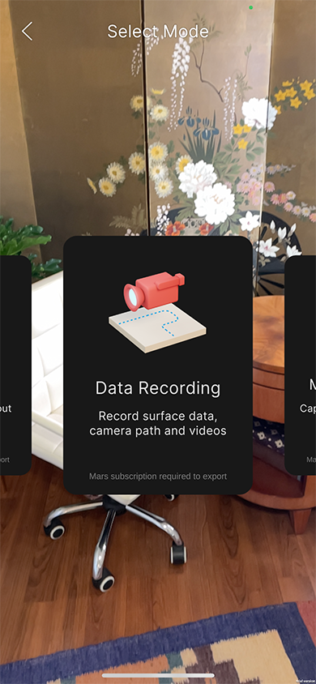
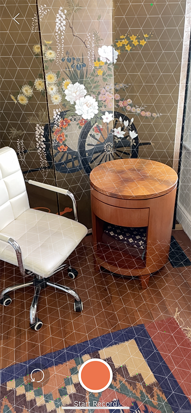
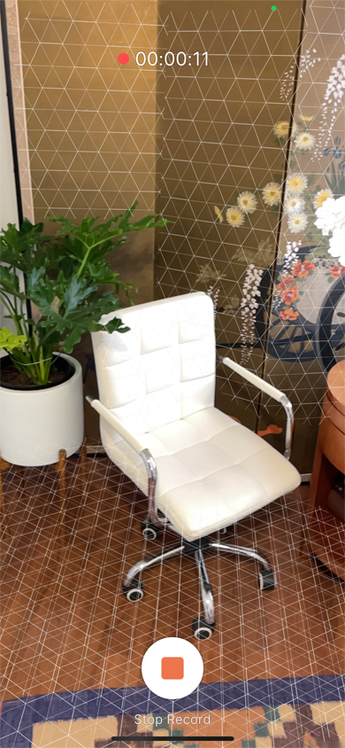
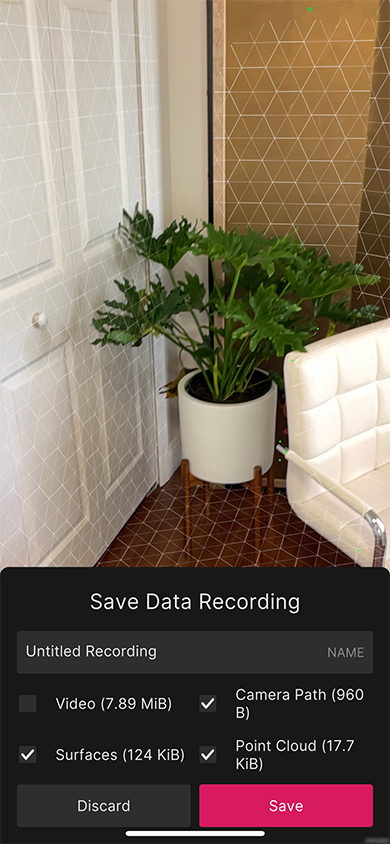

## Record Data workflow

Enter the **Record Data** workflow from the [Home view](companion-home-view.md):

The purpose of this flow is to create a data recording for playback in the Unity MARS **Simulation** view. You can either begin recording immediately, or scan some surfaces first so that they exist at the beginning of the recording. Surface scanning begins immediately when you enter the **Record Data Flow**:

Tap **Start Record** to start recording video, camera pose, and surface events:

The timer at the top of the screen indicates the current length of the recording. Tap **Stop Record** to stop recording and finalize the video:

This view allows you to make some choices before saving the recording. You can also use the text field to name the recording.

Note the file sizes next to the corresponding data tracks. The sum of these sizes is the amount of data that will be uploaded to the cloud and saved to your device.

Tap **Discard** to discard the recording. The app asks you to confirm the action. Tap **Discard** to confirm and discard the current recording. Tap **Cancel** to dismiss the confirmation prompt.

Tap **Save** to save the recording. If you are in a linked project, saving uploads the recording to the cloud and also saves it locally to the device. If you are in an unlinked project, the recording is saved locally. After you link the project, you can upload it later from the **Resource List** view.

The **Video** track is disabled by default because videos tend to be much larger than the rest of the recording. If you wish to include video with the recording, tap the checkbox before you tap **Save**. To exclude one of the other data tracks, tap its corresponding checkbox.

You can cancel this upload, as well as any web request, if it takes longer than 3 seconds. To do that, tap the **X** button that appears in the upper-right corner of the screen. You will see a progress indicator indicating the percent completion of the video upload.
