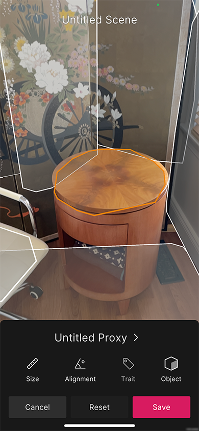

## Create Scenes

Enter the **Scene Creation** workflow from the [Home view](companion-home-view.md):

This creates a new scene with a light source and a MARSSession GameObject, and enables point cloud and surface detection. 

Tap the **Pause Scanning** button when you are done scanning surfaces, and then tap any surface to create a Proxy using the data for that surface. The **Toggle Visuals** button (top right) toggles the plane visuals to allow you to preview your content without plane visuals. Disabling plane visuals also disables the ability to create and select Proxies.

Tap the **Objects** button (bottom-right) to open the **Asset List** view. You can drag an asset up and out of the list and into the AR view. If you release the drag gesture while your finger is over a scanned surface, a Proxy is created if one was not already matched. If there is no surface under your finger, the object is placed in coordinate space without a Proxy attached (this object will not relocalize when the scene is re-opened, but will instead appear in relation to the device's position, or from the point-of-origin if opened in the Editor).

To scan or update more surfaces, press **Resume Scan**. To remove all surfaces and restart the scan, press the **Restart** button on the bottom left. You can also tap surfaces with matched proxies (highlighted in blue) to edit that Proxy.

### Proxy Inspector

When you tap a surface, the app highlights it in orange and displays the **Proxy Inspector**. Tapping outside of the selected surface deselects it.

Changes made here update the Proxy in real time and might cause it to match other surfaces.

Tap **Cancel** to discard any changes made since you opened this view. Tap **Reset** to reset the Proxy to its original state (either when it was created, or when the scene was loaded).

#### Plane size condition

Tap **Size** to open the **Plane Size Condition** Inspector:

This activates the **Plane Size Handle** in the **Camera** view, which you can use to adjust the **Plane Size Condition** constraints spatially.

The **Disable** button disables the **Plane Size Condition**. When this Condition is disabled, tap the **Enable** button to enable it. Tap **Cancel** to revert any changes you made since you opened this view. Tap **Done** to confirm your changes.

#### Alignment condition

Tap **Alignment** in the **Proxy Inspector** view to open the **Alignment Condition Inspector**:

The **Disable** button disables the **Alignment Condition**. When this Condition is disabled, tap the **Enable** button to enable it. Tap **Cancel** to revert any changes you made since you opened this view. Tap **Done** to confirm your changes.

#### Semantic tag condition

Tap **Traits** in the **Proxy Inspector** view to open the **Semantic Tag Condition Inspector**:

Currently, `floor` is the only semantic tag available in the companion app.

The **Disable** button disables the **Semantic Tag Condition**. When this Condition is disabled, tap the **Enable** button to enable it. Tap **Cancel** to revert any changes you made since you opened this view. Tap **Done** to confirm your changes.

#### Proxy metadata

Tap the name of the Proxy at the top of the **Proxy Inspector** to open the **Proxy Attributes Inspector**, where you can rename the Proxy and choose a different color for it. The color applies to the Proxy icon in the Inspector, as well as the Proxy visuals in the Editor when the Proxy is imported. Proxies with similar names can be differentiated by their color.

### Asset list view

Tap **Objects** in the **Proxy Inspector** view to open the **Asset List**. This list contains simple primitives you can use for preview purposes. Tap **Prefabs** to see a list that contains any Prefabs which have been published from the Editor. If this is a new project, the list only contains the set of default Prefabs. Tap **Primitives** to return to the list of primitives.

From either the **Prefabs** or the **Primitives** list, drag an icon up and out of the list and onto the surface. This makes the object a child of the Proxy. You can also tap an icon to instantiate the object you tapped as a child of the Proxy you are editing.

### Object Manipulation

You can add multiple objects to a Proxy or directly place them in the scene.

Tap an object to select it. An orange outline appears around the object, along with a context menu. To deselect, simply tap anywhere outside of the object.

While an object is selected, you can employ a number of gestures to transform the object:
- Drag with one finger to translate on the X and Z axes
- Drag with two fingers to translate on the Y axis
- Pinch with two fingers to scale the object
- Rotate with two fingers to rotate the object on the Y axis

While no object is selected, you can employ the same gestures to transform an object in the Scene by starting the gesture with your finger overlapping with the object of interest. 

For more precision and to translate, rotate or scale on an individual axis, you can use dedicated transform widgets by tapping the appropriate icon at the bottom of the screen.

Tap **Done** when you finished editing assets, or **Reset** to undo your changes, or **Delete** to remove the object entirely.

### Proxy List

After you dismiss the **Proxy Inspector**, the **Scene Creation Flow** header buttons reappear. Tap the **Proxy List** button in the upper right to open the **Proxy List** view. From there you can inspect and edit the properties of all proxies in your scene.

### Save and exit

When you are done editing, tap the **X** button in the top-left to exit the **Scene Creation Flow**. The app will prompt you to save your changes.

Tap the **&lt;** in the top left corner or **Cancel** to dismiss the save view and continue editing.

Tap **Discard** to discard changes and revert the scene to the state it was in before you entered the **Scene Creation Flow**. The app asks you to confirm the action. Tap **Discard** to confirm and discard the current scene changes, which returns you to the **Home** view, or tap **Cancel** to dismiss the confirmation prompt.

Tap **Save** to save the scene. This saves the scene to the cloud, adds it to the resource list, and caches a local version to the device's local storage. You can rename the scene using the text field above the two buttons.

Saving might take a while for complex scenes, or if your connection times out. If the project is not linked, saving is generally much quicker. Otherwise, even if the device is in airplane mode, the app still attempts to establish a connection, which might take a few seconds.
